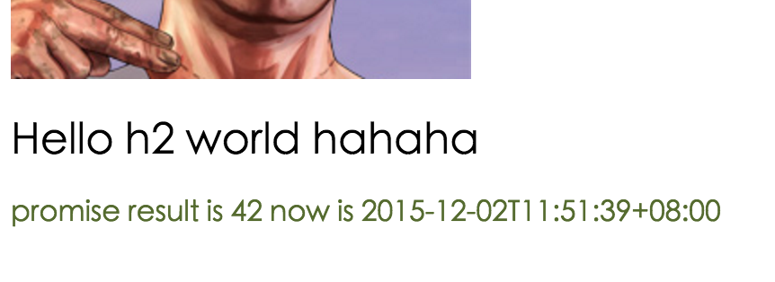
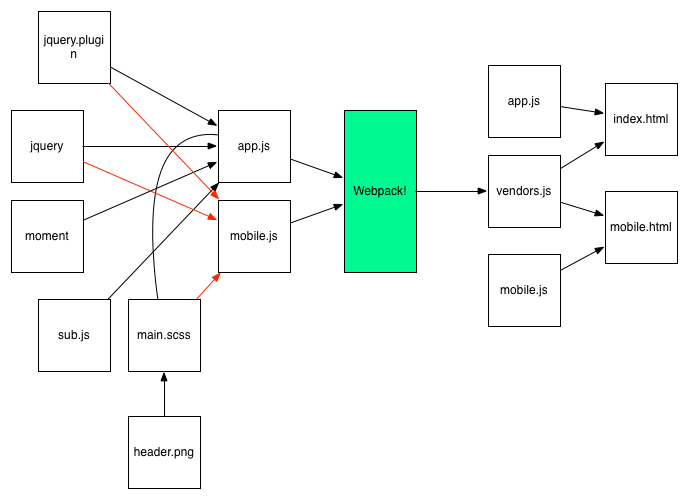

# Webpack傻瓜指南（二）开发和部署技巧

上一章讲了webpack的最基本基本用法，出乎意料的受到大家的欢迎，这一节讲更深入的技巧，这一节也更深入大家做项目的实战经验，一个项目分为开发和上线两个大的阶段，那么我们的技巧就分成这两大块来分开讲解。

## 开发技巧

### 启用source-map

现在的代码是合并以后的代码，不利于排错和定位，只需要在config中添加

```javascript
  ...
  devtool: 'eval-source-map',
  ...
```
这样出错以后就会采用source-map的形式直接显示你出错代码的位置。

### 配置webpack-dev-server代理

既然常用webpack做React一类的SPA，那么一个典型的例子就是前后端分离。后端是一个RESTful的server不管用什么写的。假定在本机他是类似http://localhost:5000/api/*这类的请求，现在添加配置让ajax请求可以直接proxy过去。

```javascript

    devServer: {
        hot: true,
        inline: true,
        //其实很简单的，只要配置这个参数就可以了
        proxy: {
          '/api/*': {
              target: 'http://localhost:5000',
              secure: false
          }
        }
    },
```

重启以后 发现/api/*的请求都代理到http://localhost:5000去了～

更多的方法可以看官方文档 [Webpack dev server proxy](https://webpack.github.io/docs/webpack-dev-server.html#proxy)

### 和express配合

上节我们说到了一个和express配合的教程，如果你前后端都使用express作为框架，那么wepack-dev-middleware就是你的最佳选择，他可以完美的和express配合起来。这个一步一步的说起来比较复杂，大家可以自己查看下面那个链接，来配置你的express。

[配置webpack-dev-middleware](http://madole.github.io/blog/2015/08/26/setting-up-webpack-dev-middleware-in-your-express-application/)

### 使用preLoaders和postLoaders

也许你想在写代码的时候检查自己的js是否符合jshint的规范，那么隆重推荐preLoaders和postLoaders，上一节我们已经非常了解loaders了，用它来处理各种类型的文件。perLoaders顾名思义就是在loaders执行之前处理的，webpack的处理顺序是perLoaders - loaders - postLoaders。

**安装jshint**

```bash
npm install jshint-loader --save-dev
```

**在config文件中配置**

```javascript
module: {
...
	//和loaders一样的语法，很简单
	perLoaders: [
		{
	   		test: /\.jsx?$/,
       		include: APP_PATH,
       		loader: 'jshint-loader'
		}
	]
}

...
//配置jshint的选项，支持es6的校验
jshint: {
  "esnext": true
},
```
好了 现在每次npm run start的时候就可以看到jshint的提示信息啦

### 加载jQuery plugin或者其他legacy第三方库

**这个是非常有用的内容**
你的项目有时候会要加载各种各样的第三方库，一些老的库不支持AMD或者CommonJS等一些先进的格式，比如一些jQuery的插件，它们都依赖jQuery，如果直接引用就会报错 jQuery is not undefined这类的错误，有几种方法解决

先创建一个jQuery plugin: plugin.js
```javascript
(function ($) {
    const shade = "#556b2f";
    $.fn.greenify = function() {
        this.css( "color", shade );
        return this;
    };
}(jQuery));
```

**第一种方法 使用webpack.ProvidePlugin**

webpack提供一个插件 把一个全局变量插入到所有的代码中，在config.js里面配置

```javascript
  ...
  plugins: [
    new HtmlwebpackPlugin({
      title: 'Hello World app'
    }),
    //provide $, jQuery and window.jQuery to every script
    new webpack.ProvidePlugin({
      $: "jquery",
      jQuery: "jquery",
      "window.jQuery": "jquery"
    })
  ]
  ...
```
在js中引用

```javascript
...
//这个也不需要了 因为$, jQuery, window.jQuery都可以直接使用了
//import $ from 'jquery';
import './plugin.js';
...
myPromise.then((number) => {
  $('body').append('<p>promise result is ' + number + ' now is ' + moment().format() + '</p>');
  //call our jquery plugin!
  $('p').greenify();
});
...
```
发现我们插入的p里面的颜色已经变成了绿色！


**第二种方法 使用imports-loader**

先安装这个loader
```bash
npm install imports-loader --save-dev
```
然后在入口js中

```javascript
//注意这种写法 我们把jQuery这个变量直接插入到plugin.js里面了
//相当于在这个文件的开始添加了 var jQuery = require('jquery');
import 'imports?jQuery=jquery!./plugin.js';

//后面的代码一样
myPromise.then((number) => {
  $('body').append('<p>promise result is ' + number + ' now is ' + moment().format() + '</p>');
  //call our jquery plugin!
  $('p').greenify();
});

```

## 部署上线

刚才说的各种情况都是在开发时候的情况，那么假如项目已经开发完了，需要部署上线了。我们应该新创建一个单独的config文件，因为部署上线使用webpack的时候我们不需要一些dev-tools,dev-server和jshint校验等。

复制我们现有的config文件，命名为 webpack.production.config.js，将里面关于
devServer等和开发有关的东西删掉。

在package.json中添加一个命令。

```javascript
  "scripts": {
    "start": "webpack-dev-server --hot --inline",
    "build": "webpack --progress --profile --colors --config webpack.production.config.js"
  },
```

当要上线的时候,运行

```bash
npm run build
```
可以发现build文件夹中生成了所有东西。

### 分离app.js和第三方库

现在我们build出来的只有一个bundle.js 如果第三方库很多的话，会造成这个文件非常大，减慢加载速度，现在我们要把第三方库和我们app本身的代码分成两个文件。

**修改entry入口文件**

```javascript
  entry: {
    app: path.resolve(APP_PATH, 'index.js'),
    //添加要打包在vendors里面的库
    vendors: ['jquery', 'moment']
  },
```
**添加CommonsChunkPlugin**

```javascript
  plugins: [
    //这个使用uglifyJs压缩你的js代码
    new webpack.optimize.UglifyJsPlugin({minimize: true}),
    //把入口文件里面的数组打包成verdors.js
    new webpack.optimize.CommonsChunkPlugin('vendors', 'vendors.js'),
    new HtmlwebpackPlugin({
      title: 'Hello World app'
    })
  ]
```
添加完毕 运行npm run build

在build文件夹中发现如下结构
* budle.js
* index.html
* vendors.js

### 生成多页面

应用不可能都是SPA，不可能只生成一个html文件，如果想生成多个html页面这么玩？其实也是很简单的:
现在的需求是这样的，有两个页面，一个叫index.html 它需要引用vendors.js和app.js这两个文件，还有一个mobile.html页面他要引用vendors.js和mobile.js这两个文件。

首先新建一个叫mobile.js的入口文件，比app.js更简单一些

```javascript
import './main.scss';
import $ from 'jquery';
import 'imports?jQuery=jquery!./plugin.js';

$(document).ready(function() {
  let app  = document.createElement('div');
  app.innerHTML = '<h1>Hello World</h1>';
  document.body.appendChild(app);
  $('h1').greenify();
});
```
在config里面配置

```javascript
  entry: {
    //三个入口文件，app, mobile和 vendors
    app: path.resolve(APP_PATH, 'index.js'),
    mobile: path.resolve(APP_PATH, 'mobile.js'),
    vendors: ['jquery', 'moment']
  },
  output: {
    path: BUILD_PATH,
    //注意 我们修改了bundle.js 用一个数组[name]来代替，他会根据entry的入口文件名称生成多个js文件，这里就是(app.js,mobile.js和vendors.js)
    filename: '[name].js'
  },
```

原来我们是没有模版文件的，原来利用的HtmlWebpackPlugin的默认模版。谁想到这伟大的插件还可以自定义模版。
所以新建一个专门放模版的文件夹templates,在里面加两个模版文件index.html 和 mobile.html

**index.html**
```html
<!DOCTYPE html>
<html>
  <head>
    <title></title>
  </head>
  <body>
    <h3>Welcome to webpack</h3>
  </body>
</html>
```

**mobile.html**

```html
<!DOCTYPE html>
<html>
  <head>
    <title></title>
  </head>
  <body>
    <h3>Welcome to mobile page</h3>
  </body>
</html>
```
继续配置config.js,现在让HtmlwebpackPlugin可以生成多个文件

```javascript
...
//Template的文件夹路径
var TEM_PATH = path.resolve(ROOT_PATH, 'templates');
...
plugins: [
  ...
  //创建了两个HtmlWebpackPlugin的实例，生成两个页面
  new HtmlwebpackPlugin({
    title: 'Hello World app',
    template: path.resolve(TEM_PATH, 'index.html'),
    filename: 'index.html',
    //chunks这个参数告诉插件要引用entry里面的哪几个入口
    chunks: ['app', 'vendors'],
    //要把script插入到标签里
    inject: 'body'
  }),
  new HtmlwebpackPlugin({
    title: 'Hello Mobile app',
    template: path.resolve(TEM_PATH, 'mobile.html'),
    filename: 'mobile.html',
    chunks: ['app', 'vendors'],
    inject: 'body'
  })
  ...
]

```
然后运行
```bash
npm run build
```

看看生成好的伟大的文件，没问题！

* app.js
* mobile.js
* vendors.js
* index.html
* mobile.html

看看引用的对应关系，完美！！

**index.html**
```html
<body>
  <h3>Welcome to webpack</h3>
  <script src="vendors.js"></script><script src="app.js"></script>
</body>
```
**mobile.html**
```html
<body>
  <h3>Welcome to mobile page</h3>
  <script src="vendors.js"></script><script src="mobile.js"></script>
</body>
```

### 生成Hash名称的script来防止缓存

经典问题,代码更新了，但是浏览器有缓存，到时候就傻了。
怎么解决，换名字呗。可以直接在后面加参数,也可以直接换掉文件名字。
webpack提供给了我们非常简单的方法，基于文件的md5，只要把

```javascript
output: {
  path: BUILD_PATH,
  //只要再加上hash这个参数就可以了
  filename: '[name].[hash].js'
},
```
运行完build以后，看看生成的文件，很完美～

**index.html**
```html
<body>
  <h3>Welcome to webpack</h3>
  <script src="vendors.js"></script><script src="app.b6641abee64c999d95c1.js"></script>
</body>
```

好了，你现在了解webpack作为一个module bundler的精髓了吧，把我们的例子做成一个图，帮助你理解一下。


## 结语

第二部分到这里结束，这一节讨论很多webpack的使用技巧，看起来比较琐碎，但是在你工作中也许会很实用，下一部分会出现大家都期待的高大上的东西，Webpack和React和Backbone等的结合。

## 很硬的链接

repo的代码已经更新，想看所有源码的可以clone下
[https://github.com/vikingmute/webpack-basic-starter](https://github.com/vikingmute/webpack-basic-starter)

同时这一系列关于Webpack的文章也可以在github找到
[https://github.com/vikingmute/webpack-for-fools](https://github.com/vikingmute/webpack-for-fools)
