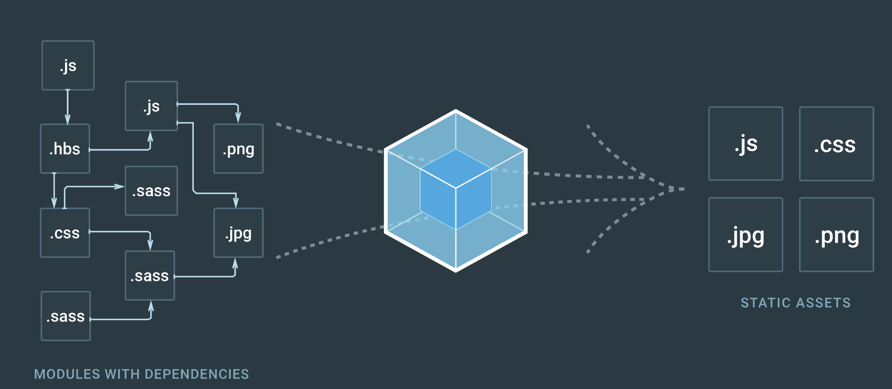

## Webpack傻瓜式指南

**大约一年前我写了第一版的 webpack 傻瓜指南，当时只是想写一篇方便大家理解通俗易懂的文章，随着时间的推移，在这一年内我和朋友出了一本名叫 React全栈 的书，同时我也在思考在当前各种前端培训鱼龙混杂的情况下，应该用什么正确的方法让大对前端开发感兴趣的人获取知识，同时 webpack2 的推出，让原来教程的一大部分都已经不再适用，所以我想可以更新一个新的傻瓜教程，让大家感受一些新版 webpack 的魅力**

## 第一章：Webpack 缘起和入门

### 1.1 模块化开发

ES6 之前，Javascript 并没有原生模块的概念，Javascript 开发者通过各种约定或妥协实现了模块的特征，如独立的命名空间，暴露属性与方法的能力等。粗略分析的话，这一过程大致经历了三个阶段：全局变量 + 命名空间（namespace），AMD ， CommonJS，ES6 模块。这部分我就不展开讲了。这里要说的就是随着 Node.js 的出现， Common.js 规范的制定，给模块开发带来了新的方法和思路。

```javascript
var path = require('path')
console.log(path)
```

想法是美好的，但是这种方法并不适用浏览器环境，单线程的 Javascript 可以使用一些另类的方法完成这些工作，比如动态加载一个 script 或者使用 XHR，当然也可以同步的加载一个 Javascript 文件，但是会直接 block 住后面代码的执行。

```javascript
//xhr
$.getScript("my_lovely_script.js", function(){
   alert("Script loaded but not necessarily executed.");
});
```
异步加载 script 的方法不是我们想要的，必须在回调方法中才能使用，有没有怎样一种方法能够像 Node.js 一样进行模块化开发呢。假如我们所写的浏览器端代码也采用 common.js 的方法，甚至能做到前后端同用一套代码，何乐而不为？

### 1.2 使用 webpack，完成一个最简单的例子

>>> 本节代码可以参见 /codes/part1/

上面提出了一个难题，简单来说 webpack 可以帮助解决这个问题（当然它的功能远远超过这个）。 先来安装一下，我在这里建议大家至少使用 node  6.0.0 以上的版本。

webpack 有两种安装方法，一种是 global 全局安装，一种是本地安装，这里先全局安装：

运行
```bash
npm install webpack -g
```
目前 webpack 的版本为 2.3.3

创建第一个称为 hello.js 的模块

Webpack 天生支持 ES6 import 和 export 的模块语法，可以直接使用。当然你也可以使用 common.js 来写。

在同一个文件夹下新建两个文件。

```javascript
//hello.js
export default function () {
    alert('from anohter planet')
}
```

```javascript
//index.js
import hello from './hello'
//调用这个方法
hello()
```
当然现在如果直接在 html 页面里面引用 index.js 是无法执行的，浏览器是无法处理 ES6 模块或者是 common.js 规范的。
那么现在使用 webpack 来处理我们的入口文件。使用 webpack cli 可以传入两个参数，第一个是入口文件，这里就是 index.js, 第二个是输出文件的名字，这里命名为 bundle.js，暂时不管 bundle.js 里面是什么内容，做了哪些工作，但是可以知道就是 webpack 使用一定的魔力，把两个文件的依赖和运行在 bundle.js 完成了。

```bash
webpack index.js bundle.js
```
现在发现 bundle.js 被创建出来，再创建一个 html 页面来引用它。

```html
<html>
  <head>
    <title> Our first webpack exmaple </title>
  </head>
  <body>
    <script src="bundle.js"></script>
  </body>
</html>
```
现在用浏览器打开这个 html 页面，发现 alert 出现了，任务完成，庆祝一下！我们可以用 ES6 来完成模块化开发啦。

### 1.3 使用配置文件

>>> 本节代码可以参见 /codes/part2/

现在每次都要使用 *webpack index.js bundle.js* 命令来生成文件，这种每次都要加参数的做法是程序员痛恨的，webpack 提供配置文件可以很容易的完成这项工作。

在项目文件夹中新建 *webpack.config.js* 文件

```javascript
module.exports = {
    // 入口文件名称
    entry: './index.js',
    // 输出文件名称
    output: {
        filename: 'bundle.js'
    }
}
```
然后在项目文件夹中运行

```bash
webpack
```

然后发现配置文件成功，文件生成成功啦！

### 1.4 使用 Loader

>>> 本节代码可以参见 /codes/part3/

上面的例子帮我们了解了 webpack 最基本的工作方式，下面来介绍一下 webpack 的一个强大功能，在开始 Loader 之前，要先知道另外一个概念 *module*，上面已经说过了这个 module（模块），上面所说的就是 common.js 或者说是 ES2015格式的import/export 的模块，在 webpack 中这两种类型的文件是天生支持的，但是 webpack 可以引入的 module，远远不止这些，可以是一个样式文件（less／css／sass）或者是一个图片文件（jpg／png／webp等等）或者是 svg文件 还可能是 coffeescript／typescript 类型，你听到这里也许有点震惊，在js文件中引进一个样式文件？应该没有人会这样做吧，那好的，让我们来试试吧。

创建一个新文件 style.css
```css
body {
    background: yellow;
}
```

在 index.js 中直接引入这个文件

```javascript
//index.js
import hello from './hello'
// 引入样式文件
import './style.css'

hello()
```
在这里我建议将 webpack 的依赖安装在本地的 package.json 里面。

```bash
npm install webpack --save-dev
```

然后运行 webpack 命令，发现出现了一行错误，看来我们还是太天真了。

```
ERROR in ./style.css
Module parse failed: /Users/vzhang/Public/webpack-for-fools/codes/part3/style.css Unexpected token (1:5)
You may need an appropriate loader to handle this file type.
| body {
|     background:yellow;
| }
 @ ./index.js 2:0-20
```

翻译过来的意思就是需要一个合适的loader来处理这个类型的文件(css文件)。webpack可以自动处理js类型的文件，但是css文件它不知道该如何处理，这里伟大的loader就出现了，其实通俗来说 loader 就是一系列的插件来处理不同类型的文件，并将它们成功的引入你的文件中。 **Loaders describe to webpack how to process non-JavaScript modules and include these dependencies into your bundles.**

在项目目录下运行,来安装处理css文件需要的两个Loader：

```bash
npm install style-loader css-loader --save-dev
```

添加完这两个loader之后，我们要教会 webpack 用什么Loader处理什么类型的文件。在 webpack.config.js 中修改：

```javascript
module.exports = {
    // 入口文件名称
    entry: './index.js',
    // 输出文件名称
    output: {
        filename: 'bundle.js'
    },
    // 这里是我们新添加的处理不同类型文件需要的 Loader
    module: {
    	rules: [
    		{ test: /\.css$/, use: [ { loader: 'style-loader' }, { loader: 'css-loader' } ]}
    	]
    }
}
```

仔细分析一下这一句语法：
```javascript
{ test: /\.css$/, use: [ { loader: 'style-loader' }, { loader: 'css-loader' } ]}
```
前面 test 传入一个正则表达式，代表你要处理什么类型的文件，这里指的是后缀名为.css的文件，后面的 use 传入一个数组，代表着这个文件会被这两个loader所处理，一个文件可以被 **多个loader** 所处理:
>>> Loaders can be chained. They are applied in a pipeline to the resource. A chain of loaders are compiled chronologically. The first loader in a chain of loaders returns a value to the next. At the end loader, webpack expects JavaScript to be returned.

读者也许会问处理 css 文件一个 css-loader 不就够了吗？ 那么 style-loader 是做什么的？这里先卖一个小关子，之后会解释原因。

配置文件改好以后，运行 webpack 命令。这次没有报错，bundle.js 文件生成了，用浏览器打开 index.html ,发现页面的背景变成了黄色，loader 运行成功了！可以庆祝一下去喝杯🍺啦！

本节最后再回到之前的问题，为什么需要两个 Loader ？ 将 style-loader 删除掉以后，再次运行 webpack，发现并没有报错，说明 css 文件可以成功的解析并且处理，但是打开 index.html 发现 css 并没有生效。可以大胆猜测 style-loader 作用是将样式动态的使用 js 插入到页面中去，如果你看 index.html 源代码也发现我们并没有引入任何的样式文件，**这正是 webpack 的特点之一，任何类型的模块（资源文件），理论上都可以通过被转化为 Javascript 代码实现与其他模块的合并与加载。**

你可以在官方网站找到各种webpack 的 loaders 列表：
[Webpack Loader List](https://webpack.js.org/loaders/)

官方网站的图完美解释了Webpack在做什么：



### 1.5 使用 Plugin

>>> 本节代码可以参见 /codes/part4/

>>> They also serve the purpose of doing anything else that a loader cannot do.

官方网站是这样解释 Plugin 是为了实现那些 loader 实现不了或不适合在 loader 中实现的功能，我还喜欢用另外一种通俗的说法来描述，Loader 关心的是当个文件的处理和转换，而 Plugin 更关注于整个项目整体的处理和帮助，这里举两个例子来：生成的 bundle.js 文件现在是没有压缩过的，怎样做这件事？ 每次 HTML 文件是手动创建的，费时费力，有没有一种方法自动生成 HTML 文件？ 答案就是使用 Plugin ！

有一些 Plugin 是内置在 webpack 中的，不需要特别安装，而还有一些不是内置的，需要通过 npm 来安装第三方包，这里自动生成 html 文件的 plugin （HtmlWebpackPlugin）就是一个第三方包，首先来安装它：

```bash
npm install html-webpack-plugin --save-dev
```
现在可以删除掉手动创建的 index.html

同时在 webpack.config.js 添加代码：

```javascript
const HtmlWebpackPlugin = require('html-webpack-plugin'); //installed via npm
const webpack = require('webpack'); //to access built-in plugins

module.exports = {
    // 入口文件名称
    entry: './index.js',
    // 输出文件名称
    output: {
        filename: 'bundle.js'
    },
    // 这里是我们新添加的处理不同类型文件需要的 Loader
    module: {
    	rules: [
    		{ test: /\.css$/, use: [ { loader: 'style-loader' }, { loader: 'css-loader' } ]}
    	]
    },
    // 添加 plugin 的配置选项
    plugins: [
        new HtmlWebpackPlugin({
            title: 'Test App',
        })
    ]
}
```
很简单，新添加一个 plugins 的 选项，接受一个数组，里面可以添加多个 plugin 的配置，HtmlWebpackPlugin 的有很多配置选项，我们这里只用了一个 title，就是 html 生成的 <title>{title}</title> 名称，如果想更多的定制化，可以看[HtmlWebpackPlugin configuration](https://github.com/jantimon/html-webpack-plugin#configuration)

用了第三方的 plugin 以后，再添加一个内置的 plugin：webpack.optimize.UglifyJsPlugin()，这个可以帮助我们用 uglifyJs 来压缩生成的 js 代码。

```javascript
plugins: [
    new webpack.optimize.UglifyJsPlugin(),
    new HtmlWebpackPlugin({
        title: 'Test App',
    })
]
```

配置完毕，运行 webpack 命令，运行完毕后，发现自动生成了 index.html 和 bundle.js, 打开bundle.js 这个文件，发现整个代码已经压缩过了。 庆祝时间，🎁！


### 1.6 实时编译

>>> 本节代码可以参见 /codes/part5/

现在的开发方式还是比较落后，代码修改以后我们需要每次运行 webpack 命令，并且刷新浏览器以后才能看到新的结果，webpack 提供了一个 webpack-dev-server 的模块来一个本地的服务器来完成这项任务，它支持 live-reload(自动刷新)，甚至还有一个新的功能 HMR （hot-module-replacement），当你的文件改变的时候，它可以做到在页面里面动态的替换其中的模块，并不需要刷新，下面就让我们了解一下怎样开启这个功能。

在项目目录里面运行

```bash
npm install --save-dev webpack-dev-server
```

在 package.json 中添加一条命令，来启动 webpack-dev-server

```javascript
"scripts": {
  "start": "webpack-dev-server",
},
```
> 为什么要这样做？

为什么要将这个命令加到 npm scripts 中呢？不能直接运行 webpack-dev-server 这条命令呢？如果读者尝试直接运行这条命令，会发现出现错误 command not found: webpack-dev-server，因为没有全局安装这个模块，所以会找不到该命令，使用 npm scripts 的好处就是：当你使用这个 script 的时候，npm 会自动寻找当前目录下   ./node_modules/webpack-dev-server/bin 这个目录下的可执行文件，而且 npm scripts 提供了很多默认命令和钩子命令，对整个项目大有裨益。

现在执行 npm start，发现终端中弹出大量信息，有两条信息值得我们注意

```bash
Project is running at http://localhost:8080/
webpack output is served from /
...
webpack: Compiled successfully
```
打开 http://localhost:8080/ 地址，发现页面成功的出现，同时修改一些 Javascript 代码，并且保存，发现页面自动的刷新了。太好了，这下开发的过程就会大大的提升效率。

webpack-dev-server 有大量的自定义配置，可以把具体的配置选项写到 webpack.config.js 中。现在代码修改还是自动刷新的，刚才所说的 HMR 听起来相当诱人，使用配置选项来开启它吧！

```javascript
// webpack.config.js
...
devServer: {
    compress: true, // 让 dev－server 启动 gzip压缩
    hot: true, // 让 dev－server 启动 HMR 功能
}
// 同时为了启用 HMR 还需要添加一个插件
plugins: [
     new webpack.optimize.UglifyJsPlugin(),
     new HtmlWebpackPlugin({
         title: 'Test App',
     }),
     // 新添加的内置的 plugin！
     new webpack.HotModuleReplacementPlugin(),
 ],
...
```

这里暂且添加这两个配置，如果读者感兴趣，可以研究所有的配置[webpack-dev-server configuration](https://webpack.js.org/configuration/dev-server/)

现在再次运行 npm start，打开 http://localhost:8080/ 地址，页面再次出现。

打开 chrome 开发者工具的 console，发现如下两行输出：
> [HMR] Waiting for update signal from WDS...
> [WDS] Hot Module Replacement enabled.

说明 HMR 已经启用，随便改变一下代码，console 里面会继续输出一些信息：
> [WDS] App hot update...
> [HMR] Checking for updates on the server...
> [HMR] Updated modules:
> [HMR]  - 15

然后页面会自动发生变化，而不会刷新整个页面，这就为我们持续开发一些feature提供了便利，不用刷新重新操作以后到达某种已经改好的状态。

这节学习了怎样时候 dev-server 做到实时编译，其实它就是把 express 做了一些自定义的配置，添加了 websocket 监听文件的变化，做出相应的改变。同时它提供了 webpack-dev-middleware 如果你想做更多更深层次的操作。
