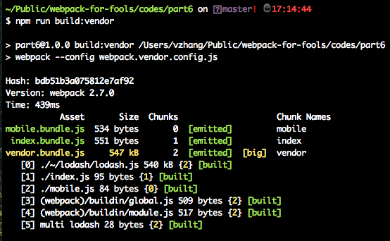

## 第二章 Webpack进阶：实战技巧

### 2.1  code splitting 特性

>>> 本节代码可以参见 /codes/part6/

在上一章中 我们提到了一段很简单的代码：

```javascript
module.exports = {
    // 入口文件名称
    entry: './index.js',
    // 输出文件名称
    output: {
        filename: 'bundle.js'
    }
}
```
这段代码非常简单移动，把入口文件打包成 bundle.js, 那么现在来进一步学习一下更复杂的用途。

**多个 entry 入口文件**
现在 entry 入口只接受一个字符串，也就是一个文件，只适合一个入口文件的场景，它也可以是一个 object 对象，如果想要一个多页面的应用的话，那么肯定会需要多个入口文件。

现在的场景要生成两个文件，一个是为PC应用的称为 *index.js* ,一个是为移动端提供的，称为 *mobile.js* 。

```javascript
// index.js
import _ from 'lodash'

console.log(_.camelCase('FOO BAR'))
console.log('this is for pc page')
```

```javascript
// mobile.js
import _ from 'lodash'

console.log(_.now())
console.log('this is for mobile page')
```
这两个脚本完成针对不同特性完成不同的功能，现在来配置 webpack.config.js 来生成两个不同的打包文件。

```javascript
const webpack = require('webpack'); //to access built-in plugins

module.exports = {
    // 入口文件名称
    entry: {
        index: './index.js',
        mobile: './mobile.js'
    },
    // 输出文件名称
    output: {
        filename: '[name].bundle.js'
    }
}
```
大家注意在 output 中添加了 **[name]** 这个通配符，对应的是上面的 entry 的文件名称，其实这样的通配符还有很多，常用的有：

* internal chunk id : [id]
* unique hash generated for every build : [hash]
* hashes based on each chunks' content: [chunkhash]

现在来运行 webpack 命令，看看生成的文件


可以清晰的看到 生成了两个文件，这种特性就被称为 code splitting.

**分离第三方库**

现在 build 之后生成两个文件，但是它们两个都包括了 lodash 这个库， 显然这不是我们想要的，如果文件体积太大的话，势必会造成加载速度变慢，最好的方法是把一些第三方常用的库(在这个例子里面为 lodash)单独的打包成一个单独的文件，而业务逻辑的代码打成另外一个文件。这样可以加快加载速度。

这里可以使用 webpack 内置的 CommonsChunkPlugin 来完成这个功能

这里新建一个文件称为 webpack.vendor.config.js

```javascript
const webpack = require('webpack'); //to access built-in plugins

module.exports = {
    // 入口文件名称
    entry: {
        index: './index.js',
        mobile: './mobile.js',
        // 新添加了 vendor 入口！
        vendor: ["lodash"],
    },
    plugins: [
        // 这里使用内置插件生成单独的 vendor file
        new webpack.optimize.CommonsChunkPlugin({
            name: "vendor"
        })
    ],
    // 输出文件名称
    output: {
        filename: '[name].bundle.js'
    }
}
```
修改一下 package.json 里面的 npm scripts，将不同命令对应不同的配置文件。

```javascript
//package.json
...
"scripts": {
  "build:split": "webpack --config webpack.config.js",
  "build:vendor": "webpack --config webpack.vendor.config.js"
},
...
```

万事具备，来运行 npm run build:vendor 命令，结果如图所示：


成功的生成了三个文件，将 lodash(vendor.bundle.js) 单独的打成了一个文件。
